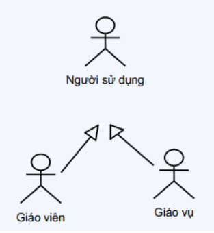
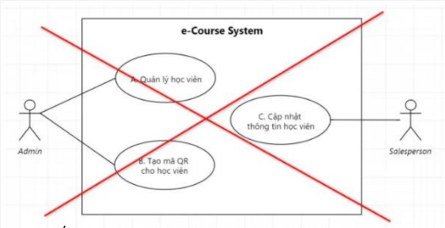

# Giới thiệu

- Một Use-Case là một chuỗi các hành động mà hệ thống thực hiện mang lại một kết quả quan sát được đối với actor.

- Có thể hiểu một Use-Case là một chức năng của hệ thống, mang một ý nghĩa nhất định đối với người dùng.

# Các bước thực hiện

### Bước 1: Xác định các Actor

- Ai sử dụng hệ thống ?
- Hệ thống nào tương tác với hệ thống ?

### Bước 2: Xác định Usecase

- Actor sử dụng chức năng gì trong hệ thống ?

### Bước 3: Xác định các mối quan hệ

- Giữa Actor với Usecase
- Giữa Actor với Actor
- Giữa Usecase với Usecase

# Viết đặc tả cho Usecase
### Cách 1
- Tên Use Case

- Mã số Use Case

- Mô tả tóm tắt

- Các bước thực hiện

- Điều kiện thoát

- Yêu cầu đặc biệt (nếu có)

- Yêu cầu trước khi thực hiện

- Điều kiện sau khi thực hiện

### Cách 2
- Dùng các bản vẽ như Activity Diagram, Sequence Diagram để đặc tả Usecase

# Các khái niệm
### System Boundary
- Được sử dụng để xác định phạm vi của hệ thống.

    

### Actor
- Các đối tượng nằm ngoài hệ thống này có tương tác với hệ thống được xem là các Actor.

- Actor có thể là con người, phần cứng, phần mềm khác tương tác với hệ thống.

- Xác định actor:
    - Actor có thể là nhóm người sử dụng hoặc các hệ thống khác.

    - Một user có thể có nhiều vai trò trong hệ thống

    - Một nhóm người dùng là một Actor

    - Mỗi nhóm người dùng (Actor) được quyền sử dụng một hay nhiều chức năng trong hệ thống

    - Một chức năng có thể cho phép nhiều nhóm người dùng sử dụng

    - Nhiều nhóm người dùng có cùng các quyền hạn giống nhau

    - Việc xác định Actor phụ thuộc ngữ cảnh và quy trình thực tế

# Các mối quan hệ
### Giữa Actor - Actor
- Quan hệ kế thừa/tổng quát hoá (`generalization`)
    - Thể hiện quan hệ thừa kế giữa các Actor với nhau

    

    

### Giữa các Usecase
- Quan hệ kế thừa(`<<generalization>>`)
    - Một số UC cùng xử lý các chức năng tương tự nên tổng quát hóa lại bằng cách gom nhóm.
    
    - Thể hiện mối quan hệ kế thừa của UC đối với UC

    - Ví dụ:
        - Đăng nhập: đăng nhập qua số điện thoại, hoặc đăng nhập qua email.

        - Đặt hàng: đặt hàng qua điện thoại, hoặc đặt hàng qua website.

        - Thanh toán: thanh toán qua thẻ ATM, qua thẻ thanh toán quốc tế, hoặc qua ví điện tử.

        - Tìm kiếm: tìm kiếm bằng từ khóa, hoặc tìm kiếm theo nhóm sản phẩm.
        

    

        
- Quan hệ bao gồm (`<<includes>>`)
    - `include`
        - Là quan hệ giữa các Usecasse với nhau

        - Mô tả việc một Use Case lớn được chia ra thành các Use Case nhỏ.

        - Mục đích: dễ cài đặt (module hóa) hoặc thể hiện sự dùng lại.

    - Quan hệ `<<includes>>`
        - Một nhóm các Use Case có chung 1 hành vi.

        - Tách hành vi đó thành 1 use case riêng (Included UC)

        - Use case tách riêng được các use case khác sử dụng tạo nên quan hệ `<<includes>>`

        - Quan hệ `<<includes>>` mang tính bắt buộc

    - Biểu diễn
        - Đoạn thẳng nét đứt

        - Với hình tam giác rỗng

        - Trỏ về phía UC được sử dụng

        - Đi kèm stereotype `<<includes>>`

    

- Quan hệ mở rộng(`<<extends>>`)
    - `extend`:
        - Được sử dụng khi có một Use Case được tạo ra để bổ sung chức năng cho một Use Case có sẵn

        - Được sử dụng trong một điều kiện nhất định nào đó.

    - Quan hệ `<<extends>>`
        - Một UC cung cấp một phần các chức năng cần thiết cho một UC khác nhưng không bắt buộc

        - UC mở rộng không nhất thiết phải dùng toàn bộ hành vi của UC gốc

    - Biểu diễn
        - Đoạn thẳng nét đứt

        - Với hình tam giác rỗng

        - Trỏ về phía UC gốc

        - Đi kèm stereotype `<<extends>>`

        - Ngoài ra, có thể chú thích extensions point

    

    

### Giữa Actor - Usecase
- Quan hệ Assosiation
    - Thường được dùng để mô tả mối quan hệ giữa Actor và Use Case

    

# Các lưu ý:

### Lưu ý 1
- Một actor phải được liên kết với ít nhất một use case.

- Một actor có thể liên kết với nhiều use case.

- Cách đặt tên:
    - Tên actor là danh từ

    - Tên usecase: động từ + danh từ (chỉ đối tượng/phạm vi tác động của UC)

    

### Lưu ý 2
- Mỗi UC là chuỗi hành động để Actor đạt một tiêu nào đó.

- Tránh việc xác định những hành động cụ thể của Actor.

    

### Lưu ý 3
- Các UC trong cùng một sơ đồ phải cùng một mức độ với nhau.

    

### Lưu ý 4
- Không nên vẽ quá nhiều UC trong một sơ đồ (tốt nhất là không quá 10 UC)

### Lưu ý 5
- Tránh lặp lại các thao tác mà UC quản lý nào cũng có: thêm, xóa, sửa,...

    

### Lưu ý 6
- Kích cỡ các Use Case trong Diagram là phải như nhau, kể cả cha-con, lẫn các mối quan hệ Include.

- Tuy nhiên, Use Case có Extend sẽ được vẽ to hơn một chút.

- Nhớ đánh dấu Use Case ID trong hình vẽ.

- Các mối quan hệ không được chồng chéo lẫn nhau.

- Có thể vẽ 1 Actor ở 2 vị trí khác nhau để tránh các đường nối bắt chéo lên nhau.

- Khi vẽ Use Case Diagram, tập trung vào câu hỏi What để tìm ra Use Case, tránh câu hỏi How.

