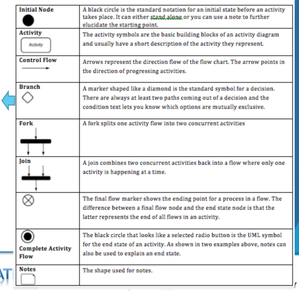

# Giới thiệu
- Activity Diagram là bản vẽ tập trung vào mô tả các hoạt động, luồng xử lý bên trong hệ thống.

- AD được sử dụng để mô tả:
    - Các qui trình nghiệp vụ trong hệ thống
    
    - Các luồng của một chức năng
    
    - Các hoạt động của một đối tượng.

- Cách vẽ

## Giải thích

1. Initial Node (Nút bắt đầu)
- Ý nghĩa: Là điểm bắt đầu của một hoạt động. Có thể dùng độc lập hoặc kết hợp với chú thích để giải thích thêm điểm bắt đầu đó.

2. Activity (Hoạt động)
- Ý nghĩa: Là khối hoạt động cơ bản trong sơ đồ hoạt động. Mỗi biểu tượng sẽ mô tả ngắn gọn một hành động hoặc bước xử lý.

3. Control Flow (Luồng điều khiển)
- Ý nghĩa: Thể hiện hướng di chuyển của luồng xử lý. Mũi tên chỉ chiều tiến của các hoạt động.

4. Branch (Rẽ nhánh / Điều kiện)
- Ý nghĩa: Dùng để thể hiện quyết định, thường có ít nhất 2 nhánh đi ra kèm điều kiện. Mỗi nhánh thể hiện một lựa chọn loại trừ lẫn nhau.

5. Fork (Phân nhánh đồng thời)
- Ý nghĩa: Dùng để tách một hoạt động thành nhiều hoạt động diễn ra đồng thời (concurrent).

6. Join (Hội tụ)
- Ý nghĩa: Dùng để kết hợp các hoạt động đồng thời trở lại thành một luồng duy nhất.

7. Final Node (Nút kết thúc)
- Ý nghĩa: Thể hiện điểm kết thúc của một luồng xử lý. Khác với “Complete Activity Flow” ở chỗ chỉ kết thúc một luồng chứ không phải toàn bộ hoạt động.

8. Complete Activity Flow (Kết thúc toàn bộ hoạt động)
- Ý nghĩa: Thể hiện trạng thái kết thúc của toàn bộ hoạt động trong sơ đồ. Có thể dùng thêm chú thích để giải thích rõ.

9. Notes (Chú thích)
- Ý nghĩa: Dùng để ghi chú, giải thích thêm cho các thành phần khác trong sơ đồ.

# Các lưu ý
- Một hoạt động bất kỳ đều phải có (duy nhất) 1 đầu vào và 1 đầu ra.

- Tên của các hoạt động phải bắt đầu bằng động từ. Tốt nhất là tuân theo công thức: Động từ + danh từ (chỉ đối tượng mà hành động tác động)

- Trong một sơ đồ, các hoạt động là duy nhất.

- Hạn chế các đường cắt trong sơ đồ

- Các dòng trạng thái khi đi ra từ branch phải được chú thích đầy đủ
