# Giới thiệu

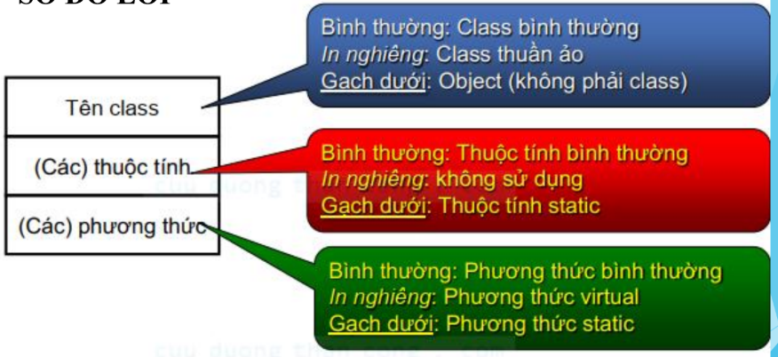

# Tầm vực
- Là phạm vi truy cập của biến hoặc phương thức, bao gồm:
    - Private: hạn chế nhất, chỉ có thể truy xuất bởi chính nó

    - Protected: hạn chế một phần, có thể được truy xuất từ chính nó hoặc các lớp con của nó.

    - Public: truy xuất từ mọi class

# Mối quan hệ giữa các lớp
### 1. Quan hệ kế thừa (`generalization`)
- Khi nói Class B kế thừa class A có thể hiểu:
    - Class B là một trường hợp đặc biệt của A

    - Class A là một trường hợp tổng quát của class B

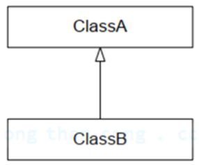

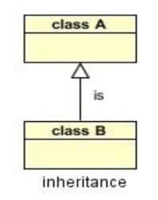

### 2. Quan hệ Association

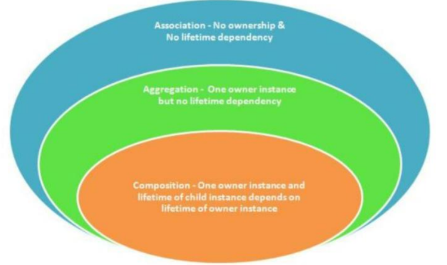

- Thể hiện mối quan hệ giữa 2 lớp.

- Khi nói class A có quan hệ association với class B ta hiểu:

    

- Ví dụ: Khách hàng có tài khoản

    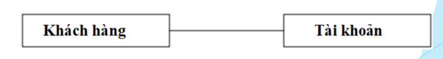

### 3. Aggregation
- Là một trường hợp đặc biệt của quan hệ association

- Thể hiện mối quan hệ “toàn thể - bộ phận” giữa hai lớp.

- Khi nói class B có quan hệ aggregation với class A thì có thể hiểu:
    - Class B là một thành phần của class A (A sở hữu B)

    - Vòng đời của “bộ phận” (class B) không phụ thuộc vào “toàn thể” (class A).

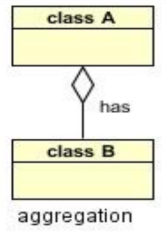

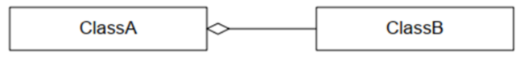

- Ví dụ:
    - “Điện thoại” có thành phần là “Pin”. Điện thoại ( CellPhone ) cần có một cục pin ( Pin ) để hoạt động. Khi điện thoại bị hư có thể đem cục pin này sang điện thoại khác. Cục pin có thể tồn tại độc lập với chiếc điện thoại.

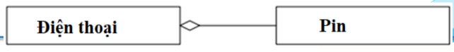

### 4. Composition
- Là một trường hợp đặc biệt của quan hệ association thể hiện mối quan hệ “toàn thể - bộ phận” giữa hai lớp nhưng chặt chẽ hơn.

- Khi nói class B có quan hệ compositionvới class A thì có thể hiểu:
    - Class B là một thành phần của class A (A sở hữu B)

    - Khi có class A thì mới phát sinh class B

    - Khi A bị huỷ thì B cũng bị huỷ theo

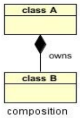

- Ví dụ:
    - “Khách sạn” có bao gồm “Phòng”. Khi “Khách sạn” bị huỷ thì “Phòng” cũng không còn. Phòng không thể tồn tại độc lập.

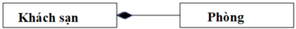

### 5. Dependency
- Thể hiện mối quan hệ phụ thuộc giữa hai lớp.

- Khi nói class A có quan hệ dependency (phụ thuộc) với class B thì có thể hiểu:
    - Một số thay đổi của B ảnh hưởng đến A (sự thay đổi của B kéo theo sự thay đổi ở A).

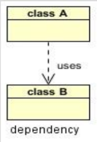

- Ví dụ:
    - “Đơn đặt hàng” phụ thuộc vào “Khách hàng”. Khi thông tin của “Khách hàng” bị thay đổi (mã khách hàng thay đổi từ kiểu string sang kiểu int) thì thuộc tính mã khách hàng ở “Đơn đặt hàng” cũng đổi kiểu dữ liệu tương ứng.

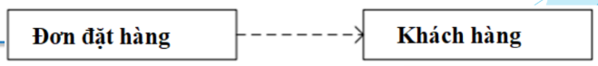

### 6. Realization
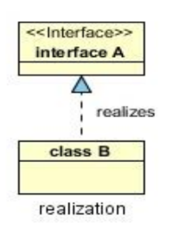

# Các bước tiến hành
#### Bước 1
- Xác định các lớp (đối tượng) cùng với thuộc tính và phương thức của chúng.

-  Đối tượng là những thực thể có các tính chất:
    - Định danh

    - Độc lập

    - Có chu trình sống (bắt đầu và kết thúc)

- Có thể xác định dựa vào các nguồn sau: sơ đồ UC, đặc tả yêu cầu, các hệ thống tương tự, chuyên gia....

- Ví dụ:
    - Xác định đối tượng trong hệ thống của một trường PTTH:

        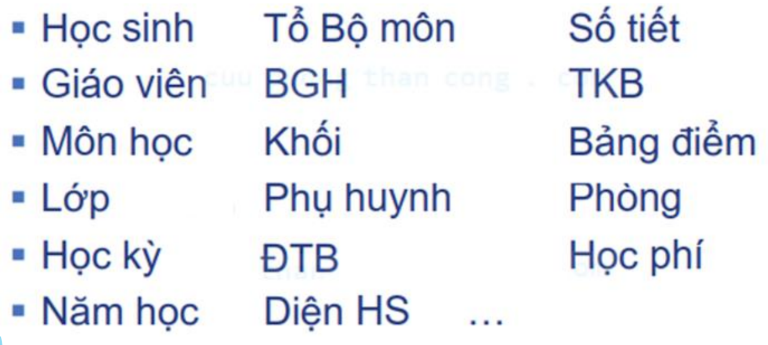

    - Đối tượng quan tâm

        

    - Đối tượng chính

        

    - Các thuộc tính và hành vi (phương thức) của lớp
        - Ví dụ: đối tượng “Học sinh”:

            - Có thuộc tính: Họ tên, Ngày sinh, giới tính....

            - Có các hành vi: làm bài thi, học, tham gia hoạt động....

#### Bước 2
- Xác định các mối quan hệ: các hành động (động từ), sự phụ thuộc giữa các đối tượng.
#### Bước 3
- Phân rã đối với trường hợp tồn tại một lớp đối tượng có thuộc tính có cấu trúc phức tạp hoặc có các thuộc tính có liên hệ chặt chẽ với nhau và có ngữ nghĩa cụ thể thì nên tách ra thành lớp đối tượng phụ
#### Bước 4
- Tổng quát hóa đối với trường hợp nhiều lớp đối tượng có nhiều đặc điểm chung.
#### Bước 5
- Tách thành các lớp con đối với đối tượng có thuộc tính phân loại và có phương thức tạo ra các kết quả khác nhau tùy thuộc vào thuộc tính phân loại đó.
#### Bước 6
- Hiệu chỉnh lại các mối quan hệ
#### Bước 7
- Kiểm tra toàn bộ sơ đồ, bổ sung những các phương thức cho các đối tượng. Xây dựng bản đặc tả lớp

# Kết quả
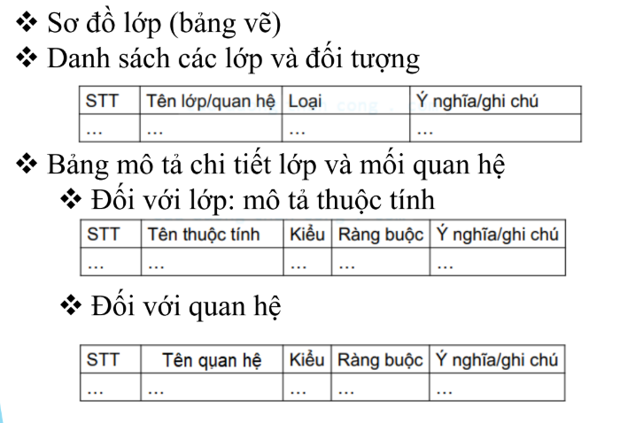