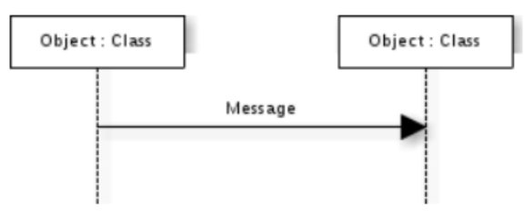
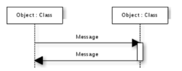
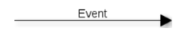
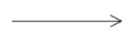
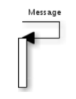
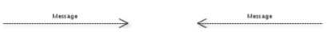
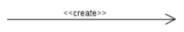
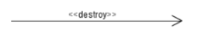

# Giới thiệu
- Là bản vẽ mô tả sự tương tác của các đối tượng để tạo nên các chức năng của hệ thống.

- Giúp xác định các trình tự diễn ra sự kiện của một nhóm đối tượng nào đó.

- Mô tả chi tiết các thông điệp được gửi và nhận giữa các đối tượng đồng thời cũng chú trọng đến việc trình tự về mặt thời gian gửi và nhận các thông điệp đó.

# Các thành phần
## Thông điệp (Stimulus/message)
- Biểu diễn bằng các đường mũi tên.

- Thông điệp được dùng để giao tiếp giữa các đối tượng và lớp.

## Xử lí bên trong đối tượng
- Biểu diễn bằng các đoạn hình chữ nhật rỗng nối với các đường đời đối tượng

## Các loại thông điệp trong biểu đồ tuần tự
#### 1. Thông điệp đồng bộ (Synchronous Message)
- Ký hiệu:
    
    

- Ý nghĩa:
    - Yêu cầu rằng khi gửi thông điệp này đi thì nó sẽ đợi thông điệp trả lời. Có nghĩa là đối tượng gửi thông điệp sẽ đợi kết quả trả về.

#### 2. Thông điệp không đồng bộ (Asynchronous Message)
- Ký hiệu:
    
    

- Ý nghĩa:
    - Là thông điệp gởi đi nhưng không đợi phản hồi.

#### 3. Thông điệp cho chính mình (Self Message)
- Ký hiệu:
    
    

- Ý nghĩa:
    - Đối tượng tự gởi cho bản thân để gọi đến phương thức/ hành vi của chính nó.

#### 4. Thông điệp trả lời hoặc trả về (Reply or Return Message)
- Ký hiệu:
    
    

- Ý nghĩa:
    - Là thông điệp trả lời lại từ một request trước đó. Có thể là từ thông điệp `Synchronous Message`

    - Thông thường sẽ trả lời tình trạng kết quả thành công hay thất bại hay kết quả trả về gì đó.

#### 5. Thông điệp tạo mới (Create Message)
- Ký hiệu:
    
    

- Ý nghĩa:
    - Được trả về khi có một đối tượng mới được tạo ra.

    - Ví dụ: Thêm sinh viên, sau khi thêm sinh viên thì có một sinh viên mới được tạo ra trong csdl. Khi đó csdl sẽ trả về thông điệp create message.

#### 6. Thông điệp xóa (Delete Message)
- Ký hiệu:

    

- Ý nghĩa:
    - Được trả về khi có một đối tượng bị xóa đi trong hệ thống.

## Các bước vẽ sơ đồ tuần tự

#### Bước 1:
- Xác định chức năng cần thiết kế. Bạn dựa vào Use Case Diagram để xác định xem chức năng nào cần thiết kế.
#### Bước 2:
- Dựa vào Activity Diagram để xác định các bước thực hiện theo nghiệp vụ.
#### Bước 3:
- Đối chiếu với Class Diagram để xác định lớp trong hệ thống tham gia vào nghiệp vụ.
#### Bước 4:
-  Vẽ Sequence Diagarm
#### Bước 5:
- Cập nhật lại bản vẽ Class Diagram

- Bởi vì khi ta vẽ:
    - Nếu có đối tượng mà cd không có thì cd bị thiếu

    - Nếu có đối tượng mà cd có nhưng không tham gia thì cd bị thừa

- Muốn đúng SD thì phải đúng UD, AD, CD