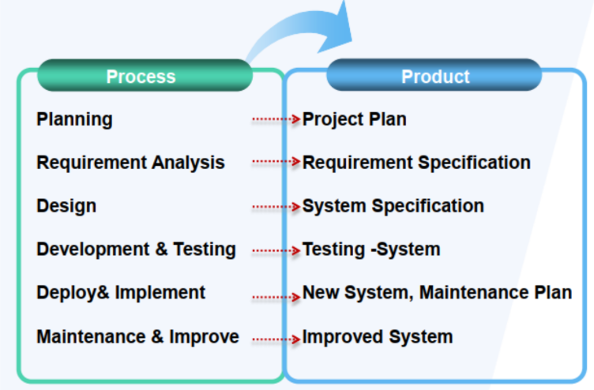

# Chu trình phát triển hệ thống (Systems DevelopmentLife Cycle -SDLC)

## Khái niệm
SDLC bao gồm nhiều giai đoạn từ khi bắt đầu dự án hệ thống cho đến khi kết thúc khai thác hệ thống.

Các giai đoạn trong chu trình có thể thay đổi tùy theo từng đơn vị.

Việc phát triển HTTT bao gồm 2 khái niệm:
- Qui trình phát triển: các giai đoạn, trình tự giai đoạn để phát triển hệ thống

- Mô hình: các phương tiện để biểu diễn nội dung của hệ thống thông qua từng giai đoạn.

## Các pha
Có thể bao gồm các pha:

### Lập kế hoạch
- Xác định giá trị kinh doanh của hệ thống.

- Phân tích tính khả thi

- Xây dựng kế hoạch công việc

- Xác định nguồn nhân lực cho dự án

- Ước lượng chi phí, phân bổ ngân sách

- Phương án kiểm soát và quản lý dự án

### Xác định và phân tích yêu cầu.
Tầm quan trọng của việc xác định yêu cầu:

- Yêu cầu từ người dùng là mục tiêu chính của việc phát triển hệ thống.

- Thiết kế ban đầu có thể chưa hoàn chỉnh so với các yêu cầu (→ phải thảo luận và điều chỉnh)

- Những sai sót trong quá trình lấy yêu cầu sẽ làm tăng chi phí, tốn thời gian thậm chí làm dự án thất bại

Yêu cầu bao gồm:

- Yêu cầu chức năng: mô tả những gì hệ thống phải làm (what) không phản ánh cách thức hệ thống thực hiện (how)

- Yêu cầu phi chức năng: là các ràng buộc để hệ thống có thể vận hành thực tế: thời gian, môi trường, ngôn ngữ...

Các khó khăn trong quá trình phân tích yêu cầu:

- Các yêu cầu thường không hoàn chỉnh, thiếu nhất quán (do người dùng không tự hệ thống một cách đầy đủ nhu cầu của họ)

- Các vấn đề về việc hiểu đúng thuật ngữ/chuyên môn của các lĩnh vực khác

- Luôn tồn tại những yêu cầu không khả thi

### Thiết kế
- Xác định chiến lược thiết kế

- Xác định các thành phần và phát thảo cấu trúc hệ thống

- Thiết kế chức năng

- Thiết kế lớp

- Thiết kế cơ sở dữ liệu

- Thiết kế giao diện

### Phát triển (cài đặt) và kiểm thử (Testing)
- Mỗi thành phần trong giai đoạn thiết kế được hiện thực hoá thành một module của hệ thống.

- Quá trình kiểm thử được thực hiện xen kẽ trong giai đoạn phát triển (kiểm thử theo từng module)

- Khi hoàn thiện, tích hợp các module và kiểm tra toàn hệ thống để đảm bảo HT hoạt động thống nhất, không bị lỗi.

- Cho khách hàng thử nghiệm hệ thống → Khi khách hàng chấp nhận sản phẩm thì giai đoạn này hoàn tất

### Triển khai và vận hành
- Lên kế hoạch triển khai hệ thống

- Thực hiện các tài liệu hướng dẫn sử dụng

- Lập kế hoạch huấn luyện khách hàng sử dụng (nếu cần)

- Kế hoạch bảo hành hệ thống

- Tiếp nhận và xử lý phản hồi của khách hàng trong quá trình vận hành thực tế.

- Tiến hành cài đặt/cấu hình hệ thống

### Bảo trì, nâng cấp
Bảo trì:
- Đảm bảo và duy trì hệ thống

- Sửa các lỗi phát sinh trong quá trình vận hành.

- Thoả thuận phương án chi phí bảo trì, bảo dưỡng

Nâng cấp:
- Bổ sung chức năng (khi có yêu cầu mở rộng hệ thống)

- Thay đổi do nâng cấp phần cứng hoặc các thành phần liên quan

## Kết quả tương ứng với các giai đoạn

