# Phương pháp mô hình hóa HTTT
- Còn gọi là phương pháp phân tích thiết kế

- Được định nghĩa là tập hợp các quy tắc và thứ tự khi thực hiện việc chuyển đổi một HTTT sang HTTT tự động hóa.

- Bao gồm các thành phần:
    - Tập khái niệm, mô hình

    - Quy trình triển khai

    - Công cụ trợ giúp

    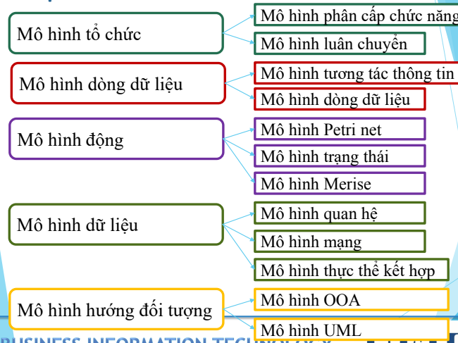

## Mô hình tổ chức
#### Mô hình phân cấp chức năng
- Thực hiện phân rã một chức năng tổng hợp thành những chức năng chi tiết hơn.

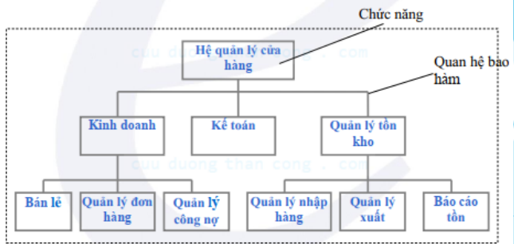

#### Mô hình luân chuyển
- Diễn tả quá trình luân chuyển thông tin qua các không gian.

- Mô hình này không thích hợp xử lý các giao tác

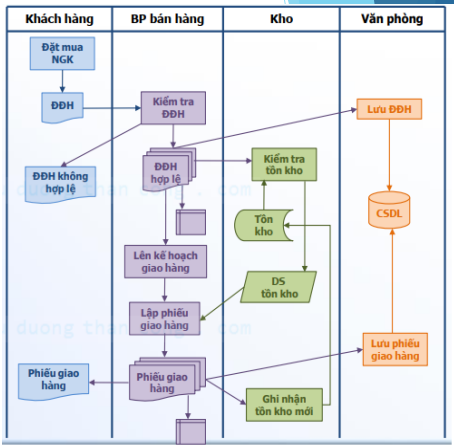

## Mô hình dòng dữ liệu
#### Mô hình tương tác thông tin
- Diễn tả quá trình giao tiếp giữa các tác nhân và không mô tả xử lý.

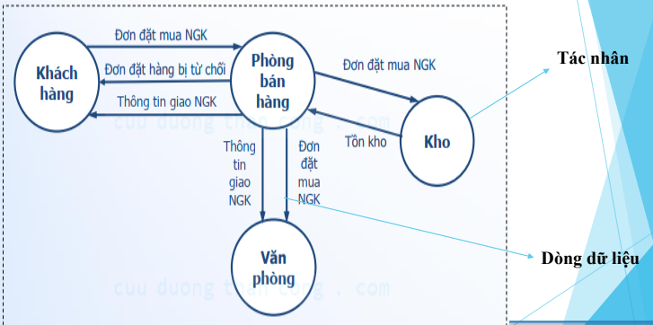

#### Mô hình dòng dữ liệu
- Diễn tả dòng dữ liệu giữa các xử lý.

- Không mô tả tính đồng bộ

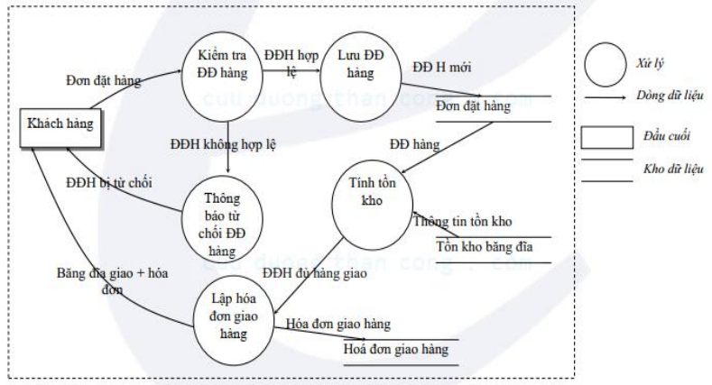

## Mô hình động
#### Mô hình Petri net
- Diễn tả biến cố và sự đồng bộ của biến cố

- Diễn tả rõ khái niệm động nhưng không mô tả được các đối tượng

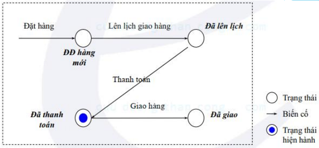

#### Mô hình trạng thái
- Diễn tả biến cố và sự đồng bộ của biến cố

- Diễn tả rõ khái niệm động nhưng không mô tả được các đối tượng

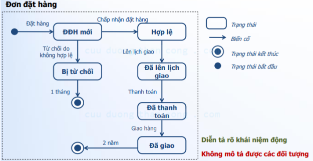

#### Mô hình Merise
- Mô tả các quan niệm xử lý

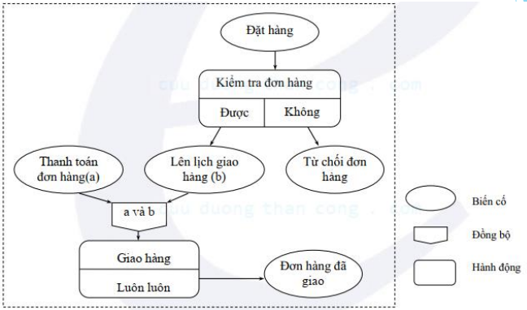

## Mô hình dữ liệu
#### Mô hình quan hệ
- Mô tả quan niệm dữ liệu

- Cấu trúc: Quan hệ (Thuộc tính khóa, thuộc tính...)

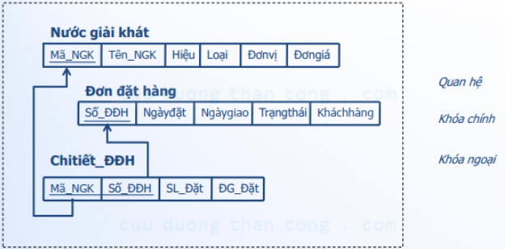

#### Mô hình mạng
- Mô tả quan niệm dữ liệu

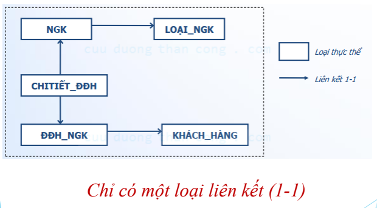

#### Mô hình thực thể kết hợp
- Mô tả quan niệm dữ liệu

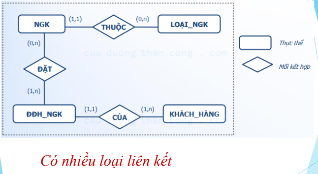

## Mô hình hướng đối tượng
#### Mô hình OOA
- Mô tả các lớp/đối tượng và mối kết hợp giữa chúng

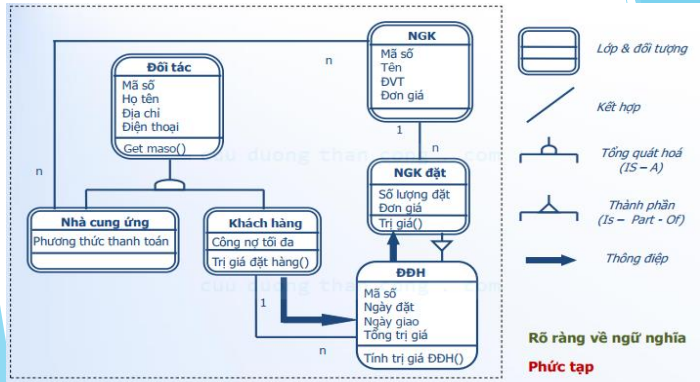

#### Mô hình UML
- Được biểu diễn bằng hệ thống các sơ đồ để biểu diễn hệ thống từ khái quát đến chi tiết

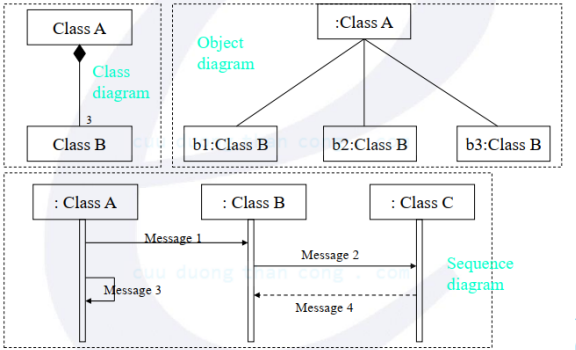
