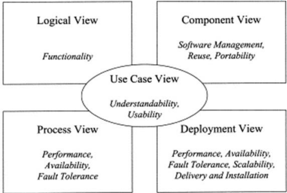

# Ngôn ngữ mô hình hóa UML
- Giới thiệu về UML: Là một ngôn ngữ hỗ trợ việc mô hình hóa hệ thống

- OOAD sử dụng UML bao gồm các thành phần sau:
    - View (góc nhìn)
    - Diagram (bản vẽ)
    - Notations (ký hiệu)
    - Mechanisms (qui tắc, cơ chế)

## View
Mỗi góc Không thể hiện hết hệ thống nhưng thể hiện rõ hệ thống ở một khía cạnh cụ thể

#### Use Case View:
Cung cấp góc nhìn về các trường hợp sử dụng giúp hiểu hệ thống có gì? ai dùng và dùng như thế nào?

#### Process/Interaction View:
Cung cấp góc nhìn động về hệ thống, xem các thành phần trong hệ thống tương tác với nhau như thế nào.

#### Component View:
Là một góc nhìn về cấu trúc giúp hiểu cách phân bổ và sử dụng lại các thành phần trong hệ thống ra sao.

#### Deployment View:
Cung cấp góc nhìn về triển khai hệ thống, nó cũng ảnh hưởng lớn đến kiến trúc hệ thống.

## Diagram
- Được dùng để thể hiện các góc nhìn của hệ thống

    

- UML 2.0 cung cấp 14 biểu đồ để mô hình hoá, trong đó có thể chia thành 2 nhóm:
    - Biểu đồ mô hình hóa cấu trúc
    - Biểu đồ mô hình hóa chức năng

#### Use Case Diagram:
- Bản vẽ mô tả về trường hợp sử dụng của hệ thống.

- Bản vẽ này sẽ giúp chúng ta biết được ai sử dụng hệ thống, hệ thống có những chức năng gì.

- Lập được bản vẽ này bạn sẽ hiểu được yêu cầu của hệ thống cần xây dựng.

#### Class Diagram:
- Bản vẽ này mô tả cấu trúc của hệ thống, tức hệ thống được cấu tạo từ những thành phần nào.

- Nó mô tả khía cạnh tĩnh của hệ thống.

#### Object Diagram:
- Tương tự như Class Diagram nhưng nó mô tả đến đối tượng thay vì lớp (Class).

#### Sequence Diagarm:
- Là bản vẽ mô tả sự tương tác của các đối tượng trong hệ thống với nhau được mô tả tuần tự các bước tương tác theo thời gian.

#### Collaboration Diagram:
- Tương tự như Sequence Diagram nhưng nhấn mạnh về sự tương tác thay vì tuần tự theo thời gian.

#### State Diagram:
- Bản vẽ mô tả sự thay đổi trạng thái của một đối tượng.

- Nó được dùng để theo dõi các đối tượng có trạng thái thay đổi nhiều trong hệ thống.

#### Activity Diagram:
- Bản vẽ mô tả các hoạt động của đối tượng, thường được sử dụng để hiểu về nghiệp vụ của hệ thống.

#### Component Diagram:
- Bản vẽ mô tả về việc bố trí các thành phần của hệ thống cũng như việc sử dụng các thành phần đó.

#### Deployment Diagram:
- Bản vẽ mô tả việc triển khai của hệ thống như việc kết nối, cài đặt, hiệu năng của hệ thống.

#### ......